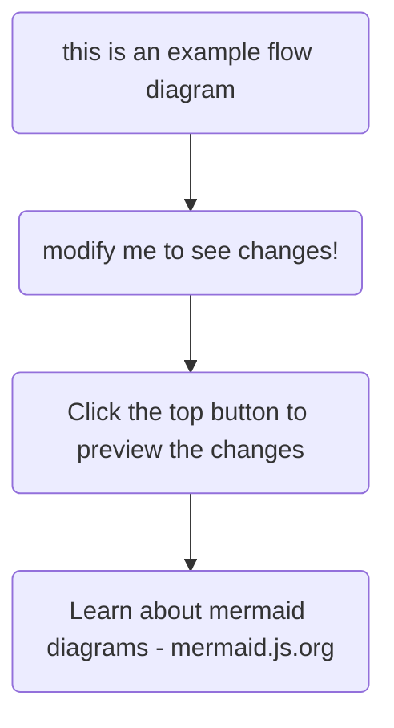

`Lorem ipsum dolor sit amet, consectetur adipiscing elit. Aliquam ultricies quis mi sed scelerisque. Suspendisse eget lacinia dolor. Donec porta id lacus sed consectetur. Suspendisse potenti. Duis elit velit, vestibulum vitae libero nec, ultrices eleifend elit. Nullam et sollicitudin mauris. Class aptent taciti sociosqu ad litora torquent per conubia nostra, per inceptos himenaeos. In ligula orci, elementum a tincidunt in, tempus eu lectus. Etiam eget nisi felis. Mauris egestas molestie sem quis varius. Etiam quis enim luctus, feugiat ante at, facilisis velit. Aliquam erat volutpat.`



| a | b |
| - | - |
| c | d |

```javascript
export default function RootLayout({
  children,
}: Readonly<{
  children: React.ReactNode
}>) {
  return (
    <ViewTransitions>
      <html lang="en">
        <Analytics />
        <SpeedInsights />
        <body className={montserrat.className}>
          <Nav />
          <div className="text-text dark:text-darkText mx-auto w-[750px] max-w-full px-5 pb-10 pt-28">
            {children}
          </div>
        </body>
      </html>
    </ViewTransitions>
  )
}
```

Phasellus sed velit porta, rhoncus nulla vel, aliquam tortor. Maecenas eu varius turpis, nec ullamcorper sem. Quisque sit amet luctus risus. Integer euismod tortor metus, nec tincidunt sem pulvinar nec. Morbi hendrerit nisi nulla, nec rhoncus nisl consectetur vitae. Phasellus convallis rhoncus arcu, vel auctor nulla. Duis nec mi dignissim, dictum orci eget, maximus ante.

Maecenas convallis felis vel ultrices commodo. Pellentesque maximus eros tellus, in porta tortor elementum eu. Nam elementum eu quam id tempor. Donec et ultrices justo. Donec vulputate nulla sed ex ultricies, in pellentesque libero iaculis. Nulla facilisi. Mauris laoreet tellus id ornare fringilla. Nam eu turpis eget est imperdiet gravida vel eget nibh. Aliquam interdum massa non ligula vulputate, ut sollicitudin erat vulputate. Proin vel velit vitae odio semper dictum in non mi. In vestibulum efficitur felis, ut sollicitudin libero rutrum ac. Cras quis scelerisque mauris.

Cras egestas lorem libero, vitae viverra magna auctor vel. Suspendisse maximus laoreet ante, at rhoncus metus bibendum in. Fusce quis elementum lorem. Proin sodales ante nec dui elementum convallis. Suspendisse potenti. Pellentesque habitant morbi tristique senectus et netus et malesuada fames ac turpis egestas. Aenean placerat interdum purus ac blandit. Mauris luctus, velit quis feugiat venenatis, metus leo varius felis, vitae porttitor quam metus ac enim. Suspendisse lacinia, urna at aliquet faucibus, nisi felis viverra lacus, ut hendrerit mauris nibh eget magna. Phasellus a laoreet erat. Quisque nec fermentum dui.

In nunc enim, pharetra id eros a, porttitor eleifend mauris. Proin nulla lectus, egestas eget nibh vitae, eleifend mattis dui. Nulla vitae sem sit amet metus porttitor laoreet. Vestibulum ante ipsum primis in faucibus orci luctus et ultrices posuere cubilia curae; Morbi consequat nunc at varius accumsan. Integer cursus quis erat vitae tempus. Vivamus egestas, nisi sit amet finibus commodo, turpis nisl accumsan ante, sed rhoncus nunc purus quis lectus. Quisque vehicula, sem ac mattis mollis, tortor magna efficitur risus, id ultrices est quam id augue.
