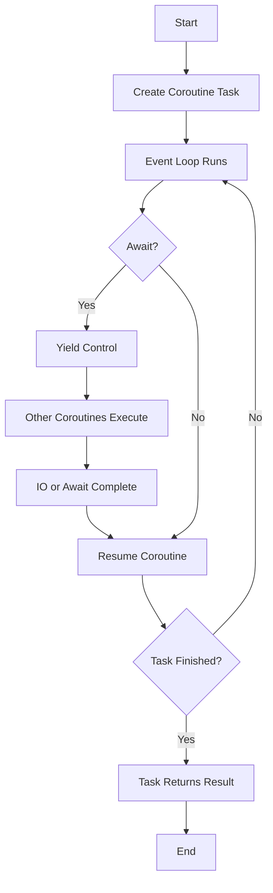
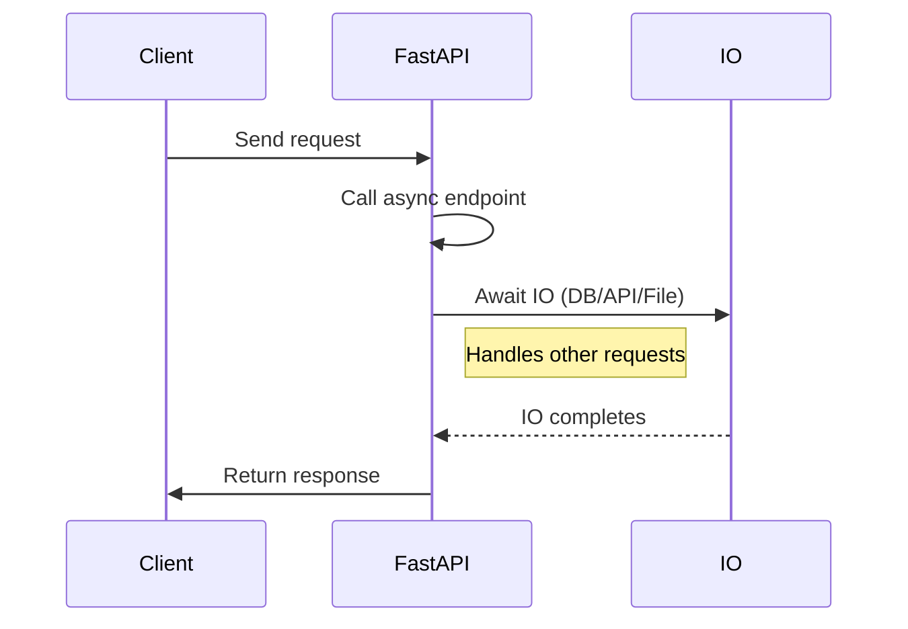

Async programming has become indispensable for backend developers looking to build scalable, production-grade APIs. Python’s asyncio library—combined with FastAPI—delivers a native async stack that sidesteps the classic bottlenecks seen in synchronous or threaded frameworks. Here’s how you tap into this power, with a no-nonsense walkthrough for backend architects and Python lovers.

## Why Asyncio Beats Sequential Python

Synchronous Python is simple: every operation waits for the previous to finish. Great for small scripts, but a deal-breaker for APIs handling thousands of requests. Asyncio leverages non-blocking IO using the event loop, unlocking real concurrency with minimal context-switching overhead.



**Key architecture features:**

* Event loop schedules coroutines efficiently
* IO-bound operations never block the main thread
* Python `async`/`await` flows mirror real-life web request patterns

Sample event loop setup:

```python
import asyncio

async def fetch_data():
    await asyncio.sleep(1)
    return "data ready"

async def main():
    result = await fetch_data()
    print(result)

asyncio.run(main())
```

Asyncio doesn’t “beat” the GIL—Python’s global interpreter lock—but for web and IO, you’ll rarely hit a ceiling. For true multicore work (image processing, ML, big data), offload with multiprocessing.

## FastAPI: Async by Design

FastAPI sets itself apart by treating async as the default. Every endpoint can be declared using `async def`, with the framework spinning up your event loop and managing request concurrency.



**Minimal async route:**

```python
from fastapi import FastAPI

app = FastAPI()

@app.get("/")
async def home():
    return {"hello": "Asyncio"}
```

**Asyncio is made for:**

* Database access (async drivers: `asyncpg`, `databases`)
* HTTP requests (use `httpx.AsyncClient`)
* File IO (`aiofiles`)
* Third-party APIs

**Sync code is fine for:** CPU-heavy number crunching, image resize, cryptography—just keep them out of your event loop.

## Case Studies: Real FastAPI Async Patterns

*Concurrent external API calls:*

```python
import httpx

@app.get("/multi-fetch")
async def multi_fetch():
    async with httpx.AsyncClient() as client:
        r1, r2 = await asyncio.gather(
            client.get("https://api.site/a"),
            client.get("https://api.site/b"),
        )
    return {"data_a": r1.json(), "data_b": r2.json()}
```

*Non-blocking file saves:*

```python
import aiofiles
from fastapi import UploadFile, File

@app.post("/upload")
async def upload(file: UploadFile = File(...)):
    contents = await file.read()
    async with aiofiles.open(f"data/{file.filename}", "wb") as out:
        await out.write(contents)
    return {"filename": file.filename}
```

*Background tasks:*

```python
from fastapi import BackgroundTasks

async def log_action(data: dict):
    await asyncio.sleep(1)
    print("Logged:", data)

@app.post("/log")
async def log(data: dict, background_tasks: BackgroundTasks):
    background_tasks.add_task(log_action, data)
    return {"status": "queued"}
```

## Concurrency vs Parallelism

**Concurrency:** Many tasks making progress, switching rapidly (Python asyncio excels here).
**Parallelism:** True simultaneous execution—use multiprocessing for heavy CPU.

## Best Practices: Asyncio in FastAPI

* Mark IO routes as `async def`
* Always choose async-compatible libraries (httpx, aiofiles, async DB drivers)
* Never block the event loop; if you need sync, manage it in worker processes
* Use `asyncio.gather` for bulk concurrent requests

## Conclusion: Async APIs For the Real World

Asyncio lets you scale Python APIs with simplicity and clarity—no thread pools, no callback hell. FastAPI helps you ship production features with native async.

Invest a few hours mastering native async IO, and you’ll deliver APIs that keep up with real-world traffic and adapt to cloud-native demands.
