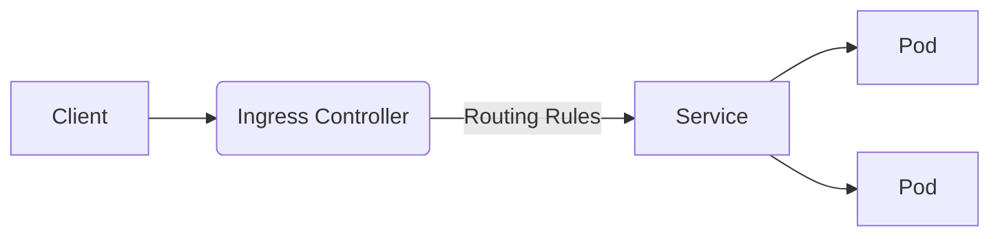

Kubernetes has revolutionized container orchestration, enabling organizations to manage scalable, resilient applications in dynamic environments. This guide provides a structured path from fundamental concepts to production-grade deployments, leveraging Kubernetes' full potential while avoiding common pitfalls.

## Why Kubernetes Outshines Docker Compose for Production

While Docker Compose simplifies local container management, Kubernetes introduces enterprise-grade orchestration capabilities. Unlike Compose's static single-node approach, Kubernetes:

* **Automates horizontal scaling** through ReplicaSets that maintain desired pod counts
* **Enforces resource quotas** via Quality of Service (QoS) classes (Guaranteed, Burstable, BestEffort) preventing resource starvation
* **Self-heals applications** by automatically replacing unhealthy pods
* **Decouples networking** through Services that abstract pod IPs with stable endpoints

```yaml
# Docker Compose vs Kubernetes equivalent
# docker-compose.yml
services:
  web:
    image: nginx:alpine
    ports:
      - "80:80"

# Kubernetes Deployment + Service
apiVersion: apps/v1
kind: Deployment
metadata:
  name: web
spec:
  replicas: 3
  selector:
    matchLabels:
      app: web
  template:
    metadata:
      labels:
        app: web
    spec:
      containers:
      - name: nginx
        image: nginx:alpine
        ports:
        - containerPort: 80
---
apiVersion: v1
kind: Service
metadata:
  name: web-service
spec:
  selector:
    app: web
  ports:
    - protocol: TCP
      port: 80
      targetPort: 80
  type: LoadBalancer
```

This declarative approach enables zero-downtime updates and cross-cloud portability.

## Core Architectural Components

### Control Plane: The Orchestration Brain

Kubernetes Architecture
*Kubernetes master-worker architecture (Source: Kubernetes.io)*

The control plane comprises:

1. **API Server**: REST interface for cluster operations
2. **etcd**: Consistent key-value store for cluster state
3. **Scheduler**: Assigns pods to nodes based on resource constraints
4. **Controller Manager**: Monitors cluster state via control loops
5. **Cloud Controller Manager**: Cloud provider integrations

### Node Components

Worker nodes execute workloads using:

* **kubelet**: Pod lifecycle manager
* **kube-proxy**: Network rules for Service IPs
* **Container Runtime**: Docker, containerd, or CRI-O

## Hands-On Cluster Setup

### Local Development with Minikube

```bash
# Install prerequisites
curl -LO https://storage.googleapis.com/minikube/releases/latest/minikube-linux-amd64
sudo install minikube-linux-amd64 /usr/local/bin/minikube

# Start cluster with 4 CPUs and 8GB RAM
minikube start --cpus=4 --memory=8192 --driver=docker

# Verify cluster status
kubectl cluster-info
kubectl get nodes
```

Minikube creates a single-node cluster ideal for development.

### Production-Grade Cluster with kubeadm

```bash
# Initialize control plane
sudo kubeadm init --pod-network-cidr=10.244.0.0/16

# Configure kubectl
mkdir -p $HOME/.kube
sudo cp -i /etc/kubernetes/admin.conf $HOME/.kube/config
sudo chown $(id -u):$(id -g) $HOME/.kube/config

# Install network plugin (Calico)
kubectl create -f https://docs.projectcalico.org/manifests/calico.yaml

# Join worker nodes
kubeadm token create --print-join-command
```

kubeadm automates TLS certificate management and control plane setup.

## Deploying Your First Application

### Multi-Tier WordPress Deployment

```yaml
# mysql-deployment.yaml
apiVersion: apps/v1
kind: StatefulSet
metadata:
  name: mysql
spec:
  serviceName: "mysql"
  replicas: 1
  selector:
    matchLabels:
      app: mysql
  template:
    metadata:
      labels:
        app: mysql
    spec:
      containers:
      - name: mysql
        image: mysql:5.7
        env:
        - name: MYSQL_ROOT_PASSWORD
          valueFrom:
            secretKeyRef:
              name: mysql-secrets
              key: root_password
        ports:
        - containerPort: 3306
---
# wordpress-deployment.yaml
apiVersion: apps/v1
kind: Deployment
metadata:
  name: wordpress
spec:
  replicas: 3
  selector:
    matchLabels:
      app: wordpress
  template:
    metadata:
      labels:
        app: wordpress
    spec:
      containers:
      - name: wordpress
        image: wordpress:php8.0-apache
        env:
        - name: WORDPRESS_DB_HOST
          value: mysql
        - name: WORDPRESS_DB_USER
          value: root
        - name: WORDPRESS_DB_PASSWORD
          valueFrom:
            secretKeyRef:
              name: mysql-secrets
              key: root_password
        ports:
        - containerPort: 80
---
# wordpress-service.yaml
apiVersion: v1
kind: Service
metadata:
  name: wordpress
spec:
  type: LoadBalancer
  selector:
    app: wordpress
  ports:
    - protocol: TCP
      port: 80
      targetPort: 80
```

Apply with `kubectl apply -f mysql-deployment.yaml -f wordpress-deployment.yaml -f wordpress-service.yaml`.

## Advanced Deployment Strategies

### Blue/Green Deployments

```yaml
apiVersion: networking.k8s.io/v1
kind: Ingress
metadata:
  name: my-app
  annotations:
    nginx.ingress.kubernetes.io/canary: "true"
    nginx.ingress.kubernetes.io/canary-weight: "10"
spec:
  rules:
  - host: app.example.com
    http:
      paths:
      - backend:
          service:
            name: my-app-v2
            port:
              number: 80
        path: /
        pathType: Prefix
```

Gradually shift traffic between versions using service mesh or ingress controllers.

### GitOps with FluxCD

```bash
flux bootstrap github \
  --owner=my-org \
  --repository=my-repo \
  --branch=main \
  --path=./clusters/production
```

FluxCD synchronizes cluster state with Git repositories, enabling auditable infrastructure changes.

## Network Architecture Deep Dive

Kubernetes implements a flat network model where:

1. **Pods** get unique IPs routable across nodes
2. **Services** provide stable VIPs through kube-proxy's iptables/IPVS rules
3. **Ingress Controllers** handle L7 routing and TLS termination



*Traffic flow through Kubernetes network components*

Implement network policies for microsegmentation:

```yaml
apiVersion: networking.k8s.io/v1
kind: NetworkPolicy
metadata:
  name: frontend-policy
spec:
  podSelector:
    matchLabels:
      role: frontend
  ingress:
  - from:
    - podSelector:
        matchLabels:
          role: backend
    ports:
    - protocol: TCP
      port: 80
```

This restricts frontend pods to only receive traffic from backend pods on port 80.

## Monitoring & Optimization

### Prometheus-Grafana Stack

```bash
helm repo add prometheus-community https://prometheus-community.github.io/helm-charts
helm install kube-prometheus prometheus-community/kube-prometheus-stack
```

Monitor key metrics:

* **Cluster**: Node CPU/Memory usage, Pod restarts
* **Applications**: Request latency, error rates
* **Control Plane**: etcd write latency, API server throughput

### Vertical Pod Autoscaler

```yaml
apiVersion: autoscaling.k8s.io/v1
kind: VerticalPodAutoscaler
metadata:
  name: my-app-vpa
spec:
  targetRef:
    apiVersion: "apps/v1"
    kind: Deployment
    name: my-app
  updatePolicy:
    updateMode: "Auto"
```

VPA automatically adjusts CPU/memory requests based on usage patterns.

## Securing Your Cluster

### Role-Based Access Control

```yaml
apiVersion: rbac.authorization.k8s.io/v1
kind: Role
metadata:
  namespace: default
  name: pod-reader
rules:
- apiGroups: [""]
  resources: ["pods"]
  verbs: ["get", "watch", "list"]
---
apiVersion: rbac.authorization.k8s.io/v1
kind: RoleBinding
metadata:
  name: read-pods
  namespace: default
subjects:
- kind: User
  name: jane
  apiGroup: rbac.authorization.k8s.io
roleRef:
  kind: Role
  name: pod-reader
  apiGroup: rbac.authorization.k8s.io
```

Principle of Least Privilege (PoLP) implementation.

### Pod Security Standards

Enforce security contexts:

```yaml
securityContext:
  runAsNonRoot: true
  allowPrivilegeEscalation: false
  capabilities:
    drop:
    - ALL
  seccompProfile:
    type: RuntimeDefault
```

Adopt PSA (Pod Security Admission) to restrict privileged pods.

## Conclusion: Kubernetes as a Strategic Platform

Kubernetes has evolved beyond container orchestration into a platform for:

* **Multi-cloud deployments** through consistent APIs across providers
* **Edge computing** with lightweight distributions like k3s
* **Machine learning workflows** via Kubeflow and TensorFlow Serving
* **Serverless architectures** using Knative and OpenFaaS

As you scale, consider:

1. **Service meshes** (Istio, Linkerd) for fine-grained traffic control
2. **Policy engines** (Kyverno, OPA) for governance
3. **Custom controllers** through Operator Framework

The Kubernetes ecosystem continues to grow, with 154 Certified Service Providers and 100+ SIGs (Special Interest Groups) driving innovation\[^16]. By mastering its core concepts and embracing its extensibility, teams can build future-proof infrastructure that adapts to evolving business needs.

```bash
# Get involved in Kubernetes development
git clone https://github.com/kubernetes/kubernetes
cd kubernetes
./hack/install-etcd.sh
make
```
